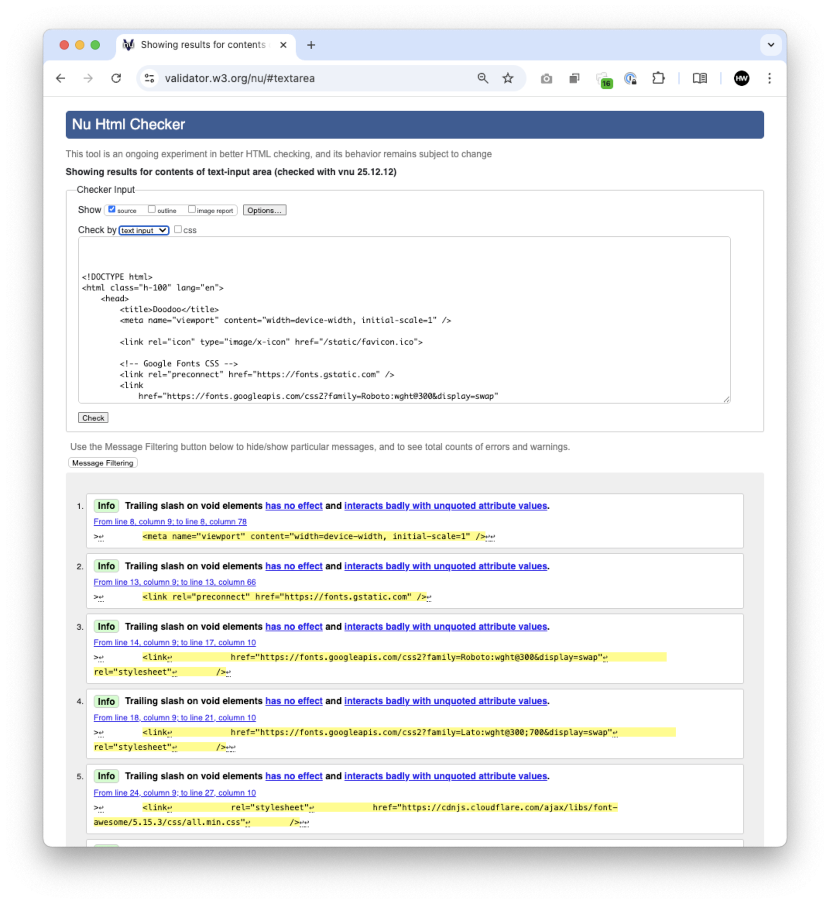
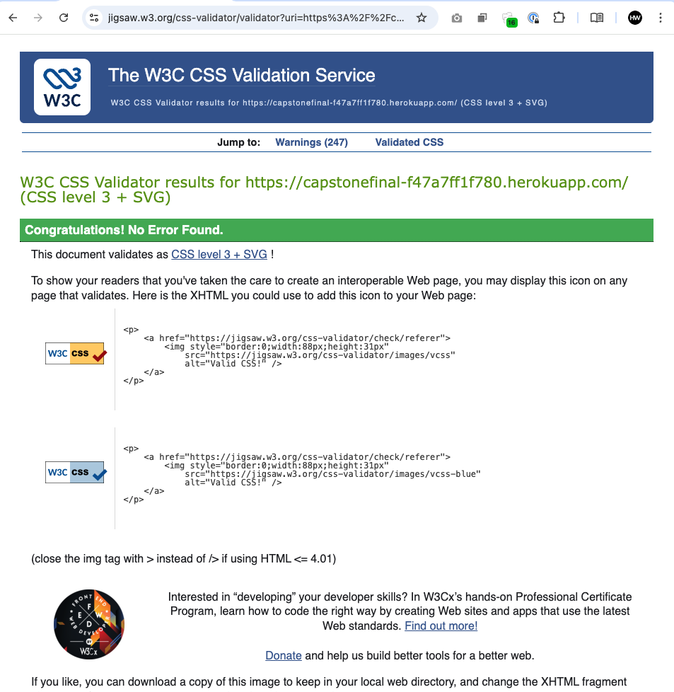
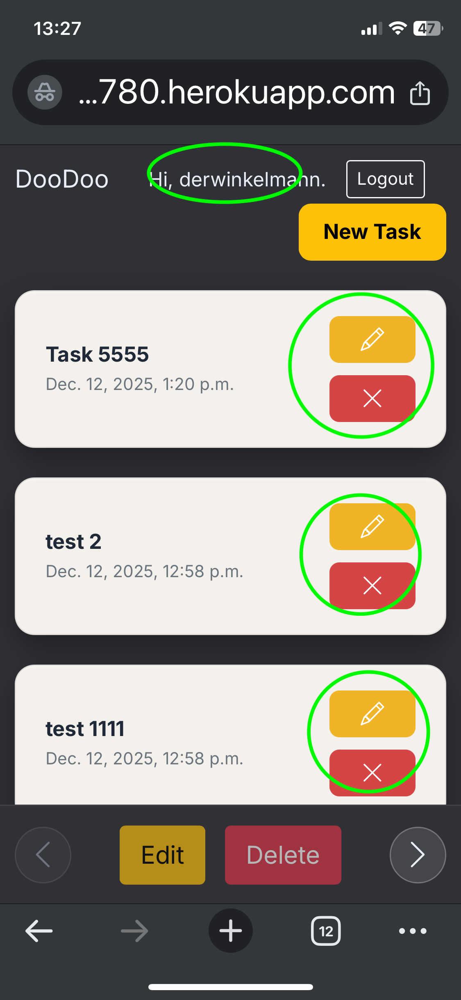
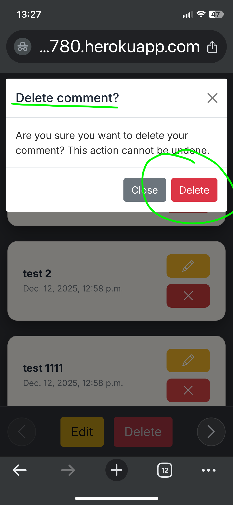
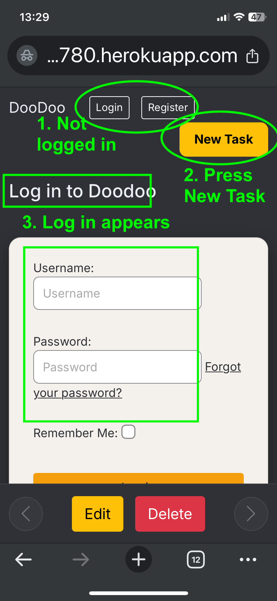
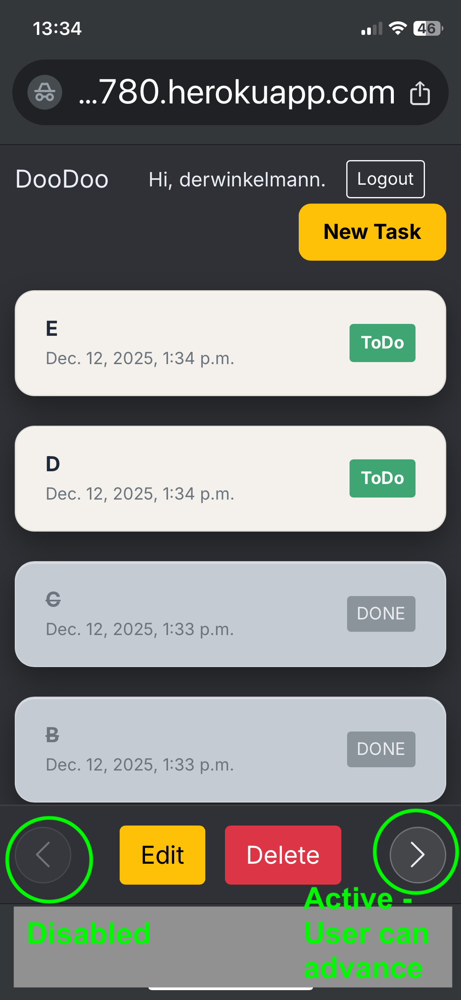

# README Framework

## Project Title

_Doodoo – Personal Task Tracker_

## Index

1. Overview
2. Agile Development Process
3. Features
4. Improvements and Future Development
5. Deployment
6. Testing and Validation
7. AI Implementation
8. Database
9. References
10. Tech Used
11. Learning Points

---

# 1. Overview

<details>
<summary><strong>Project Scope</strong></summary>

## **Overview**

Doodoo is a simple personal task manager designed to help a single user create, view, update, and delete their own daily tasks. The goal from the start was to keep the functionality extremely focused — just core CRUD actions — so that I could learn Django properly without taking on more complexity than my current skill level allowed.

Because I began this course with no coding experience, the app intentionally follows the structure, patterns, and logic used in the _CodeStar Blog_ project from the LMS. Reusing and adapting those examples (especially the views, templates, and authentication flow) allowed me to build something stable and functional while staying within what I could realistically understand and maintain.

The app is built as **mobile-first**, since that is how people naturally use quick task lists. The desktop layout simply supports the same experience but is not the primary design focus. The project also supports **PWA behaviour** (planned in future features) so it can eventually be launched directly from a mobile home screen.

The application is deliberately **single-user**, meaning each logged-in user only sees their own tasks. This avoids the complexity of multi-user task sharing and keeps the app tightly scoped for the MVP.

Doodoo is simple by design — a clean UI, essential features, and a learning-focused build that reflects where I am in my development journey.

</details>

---

# 2. Agile Mehodology Process

### Agile Approach & Project Board

This project was developed using an Agile-inspired workflow, following short iterative cycles and continuously refining features as the app evolved.  
To keep everything organised, I used a GitHub Kanban board to track user stories, prioritise tasks using the MoSCoW method, and monitor progress throughout development.

You can view the full project board here:  
👉 **GitHub Kanban Board:** https://github.com/users/daswinkelmann/projects/4

The board contains all Must/Should/Could tasks, their current status, and a clear record of how the project moved from planning → MVP → refinement.

### MoSCoW Prioritisation

On my project board, I used the MoSCoW method to keep things simple and focused:

**Must haves** — The essentials. These are the features required to deliver the MVP. Nothing else gets touched until these are done.

**Should haves** — Valuable additions that improve the product but aren’t strictly required for the MVP. These only begin once all Musts are complete.

**Could haves** — Nice extras. These aren’t critical, but they would enhance the overall experience if time allows. Only tackled after both Musts and Shoulds are finished.

<details>
<summary><strong>User Stories</strong></summary>

Core User Stories (MVP)
As a user, I want to register for an account so that I can securely access my personal task list. Acceptance criteria: A registration form is available, valid details create a new account, and the user can log in immediately after registration.

As a user, I want to log in and log out so that my tasks remain private and secure. Acceptance criteria: Only authenticated users can access the app, login validates credentials correctly, logout ends the session and redirects to the login page.

As a user, I want to create a new task so that I can track things I need to do. Acceptance criteria: A task form is available, required fields must be completed, and a newly created task appears in the task list after submission.

As a user, I want to view all my tasks in one place so that I can easily manage my workload. Acceptance criteria: The home screen displays only the logged-in user’s tasks and updates automatically after create, edit, or delete actions.

As a user, I want to edit an existing task so that I can update its details if things change. Acceptance criteria: The edit form is pre-filled with the task’s current data, changes are saved correctly, and the updated task is shown on the task list.

As a user, I want to mark a task as done so that I can track my progress. Acceptance criteria: A visible control allows toggling between To-Do and Done, and the updated status is immediately reflected in the task list.

As a user, I want to delete a task so that I can permanently remove completed or unwanted items. Acceptance criteria: The delete option is available on each task, and confirmed deletion permanently removes the task from the database and task list.

As a user, I want to receive a confirmation before deleting a task so that I do not delete tasks accidentally. Acceptance criteria: A confirmation screen or message appears before deletion and provides options to confirm or cancel the action.

As a user, I want the app to work smoothly on my mobile phone so that I can manage tasks on the go. Acceptance criteria: The layout adapts to mobile screens, buttons are easy to tap, and no horizontal scrolling is required.

Progressive Web App (PWA) User Stories
As a user, I want to install the app on my phone home screen so that it feels like a native mobile app. Acceptance criteria: The app provides a valid manifest file, displays an install prompt on supported devices, and launches in standalone mode when opened from the home screen.

As a user, I want the app to load even when my internet connection is unstable so that I can always access my task list. Acceptance criteria: Core app pages and static assets are cached by a service worker and load successfully when offline.

</details>

<details>
<summary><strong>Wireframes</strong></summary>

**Mobile Wireframes**
Note: this project is designed as a mobile first app. Desktop and tablet are nice to have, and the app will respond to these formats, but has been optimised for mobile portrait use.


**Tablet Wireframes**


**Desktop Wireframes**


</details>

<details>
<summary><strong>Typography & Colour Choices</strong></summary>

## Typography & Colour Choices

The visual design of _Doodoo_ focuses on clarity, speed of use, and legibility across devices, particularly on mobile. A modern sans-serif typeface was chosen to keep the interface clean, neutral, and easy to read at small sizes. Text hierarchy is deliberately simple, with clear separation between task titles, supporting metadata, and interactive elements, allowing users to scan tasks quickly without cognitive load.

A dark background was selected as the primary canvas to improve contrast and reduce eye strain, especially for mobile users who are likely to interact with the app in short, frequent sessions. Task items sit on lighter “pill” cards to clearly separate content from the background, while bright, high-contrast colours are used for primary actions such as **Done**, **Edit**, and **Delete**. This ensures interactive elements are instantly recognisable and accessible, even at a glance. The overall palette is warm and restrained, balancing usability with a friendly, approachable feel.

---

## Colour Palette

| Usage                       | Colour         | Hex       |
| --------------------------- | -------------- | --------- |
| Main background             | Dark charcoal  | `#2F3136` |
| Task card background        | Warm off-white | `#F4F1EC` |
| Task card border            | Soft grey      | `#D9D6D2` |
| Primary text (headings)     | Dark slate     | `#1F2937` |
| Secondary text (dates/meta) | Muted grey     | `#6B7280` |
| Primary action (Done)       | Green          | `#22C55E` |
| Edit action                 | Amber / yellow | `#F59E0B` |
| Delete action               | Red            | `#E84610` |
| Links & accents             | Teal           | `#188181` |

</details>

---

# 3. Features

<details>
<summary><strong>All Application Features</strong></summary>

## Features

### Overview

**Doodoo** is a simple, mobile-first personal task manager built to demonstrate clean CRUD functionality, user authentication, and a smooth workflow.  
The design focuses on clarity and ease of use, especially on mobile devices, where the app behaves like a portrait-first productivity tool.

### Core Features

#### ✔️ Secure User Login (Single User Access)

-   The app requires users to authenticate before accessing any task functionality.
-   If an unauthenticated visitor tries to access the **Add Task** page or manage tasks, they are automatically redirected to the login screen.
-   Once authenticated, the user sees only **their own tasks** — each task is linked to a specific user in the database.
-   This ensures privacy and prevents cross-account visibility.

#### ✔️ CRUD Task Functionality

-   **Create:** Users can add new tasks via a clean form. Created tasks appear instantly on the homepage.
-   **Read:** The homepage displays all tasks belonging to the logged-in user, prioritising To-Do items over completed ones.
-   **Update:** Tasks can be edited using a dedicated edit page (reusing familiar patterns from the LMS project).
-   **Delete:** Tasks can be deleted through a confirmation modal inspired by the Codestar blog walkthrough.

#### ✔️ Task Management Modes

-   Normal view shows To-Do tasks with a **Done** button.
-   A dedicated **Manage Mode** toggles the interface to display Edit and Delete controls for each task, matching the project wireframes.

### Mobile-First Design

-   The entire UI has been designed with **portrait mobile screens** in mind.
-   Buttons are large and easy to tap.
-   Cards and spacing adapt cleanly to small screens, with no horizontal scrolling.

### PWA Foundations

-   The app is structured so it can operate as a **Progressive Web App (PWA)**.
-   When PWA support is added (manifest + service worker), users will be able to:
    -   Install the app to their mobile Home Screen.
    -   Launch it in standalone mode.
    -   Access cached content when offline.
-   These PWA requirements are fully documented in the **Future Features** section and will be implemented after the core MVP.

---

</details>

---

# 4. Improvements and Future Development

<details>
<summary><strong>Future Feature Ideas</strong></summary>

_Future features list_

**Progressive Web App (PWA) User Stories**

PWA - install on a phone to seem like a native app
As a user, I want to install the app on my phone home screen so that it feels like a native mobile app. Acceptance criteria: The app provides a valid manifest file, displays an install prompt on supported devices, and launches in standalone mode when opened from the home screen.

PWA 2/2 - App to load on a phone even with no internet connection
As a user, I want the app to load even when my internet connection is unstable so that I can always access my task list. Acceptance criteria: Core app pages and static assets are cached by a service worker and load successfully when offline.

**Future / Nice-to-Have User Stories**

Nice-to-Have - filter by status
As a user, I want to filter tasks by status so that I can focus only on tasks that are still to be completed.
Acceptance Criteria
Users can select a filter option (e.g., All, Completed, Not Completed) and the task list updates instantly to show only matching tasks.
When a filter is active, the UI clearly indicates which filter is applied.

Nice to have - add due dates
As a user, I want to add due dates to tasks so that I can manage deadlines more effectively.
Acceptance Criteria
When creating or editing a task, users can select a due date using a date picker.
Tasks with due dates display that date clearly in the task list.

Nice to have - organise into preset categories
As a user, I want to organise tasks into preset categories so that my task list feels structured.
Acceptance Criteria
Users can choose from a predefined list of categories (e.g., Health, School, Work) when creating or editing a task.

The task list displays each task’s assigned category.

Nice to have - streaks
As a user, I want to track streaks or completion goals so that I stay motivated.
Acceptance Criteria
Completing tasks on consecutive days increases a visible “streak” counter.
The streak counter resets automatically if the user does not complete any tasks in a 24-hour period.

Nice to have - export/backup tasks
As a user, I want to export my tasks so that I can back them up or use them elsewhere.
Acceptance Criteria
Users can tap an “Export” button to download a file (CSV or text) containing all their tasks and statuses.
Exported files include at minimum: task title, status, category, and due date (if used).

</details>

+++ADD KNOWN ISSUES SECTION FROM TESTING+++

---

# 5. Deployment

<details>
<summary><strong>Deployment Steps</strong></summary>

## **Deployment**

This project was deployed using **Heroku**, following the standard Django deployment workflow taught in the Code Institute curriculum.  
The aim was to ensure the application ran securely, with a production-ready database and static file handling.

---

### **1. Project Preparation**

Before deployment, the following production files and settings were added:

-   `requirements.txt` — listing all the project dependencies
-   `Procfile` — telling Heroku how to run the Django app
-   Set `DEBUG = False` and configured `ALLOWED_HOSTS`
-   Added Whitenoise to serve static files in production
-   Created and migrated the database on Heroku

The environment variables were moved into Heroku’s config settings, including:

-   `DATABASE_URL`
-   `SECRET_KEY`
-   `CLOUDINARY_URL` _(if used later for media files)_

---

### **2. Connecting the GitHub Repository**

The project was deployed directly from GitHub:

1. Logged into **Heroku Dashboard**
2. Created a new Heroku app
3. Connected the app to GitHub
4. Selected the `main` branch
5. Enabled **Automatic Deploys** (optional but recommended)

---

### **3. Deploying the Application**

After configuration:

1. Clicked **Deploy Branch**
2. Heroku installed dependencies from `requirements.txt`
3. Ran the build process
4. Released the app
5. Confirmed that the link to the live site was working

If migrations were needed, these were run using:

```
heroku run python manage.py migrate
```

---

### **4. Static Files**

Whitenoise was used to serve static files in production.  
The following were added:

-   `"whitenoise.middleware.WhiteNoiseMiddleware"` to `MIDDLEWARE`
-   `STATIC_ROOT` and `STATICFILES_DIRS` settings
-   `collectstatic` was run automatically by Heroku

---

### **5. Final Checks**

After deployment, I verified:

-   User authentication (login, logout, signup) works on live environment
-   CRUD functionality behaves correctly
-   The app loads correctly on mobile
-   The nav bar updates based on the login state
-   No console errors or missing files

---

### **6. Live Link**

> **Live Deployment:** _ADD YOUR HEROKU LINK HERE_

---

### **Notes for Future Deployment**

-   When the PWA version is added, additional configuration will be needed (manifest.json, service worker, cache strategy).
-   For image uploads or future media features, Cloudinary or AWS S3 can be added.
</details>

---

# 6. Testing and Validation


<details>
<summary><strong>HTML Validation</strong></summary>
*screenshots/results* 

The rendered HTML for all key pages (Home, Login, Signup, Add Task, Edit Task, and Manage Mode) was tested using the W3C HTML Validator. Errors identified during testing were fixed, and the final deployed version passes validation without critical errors.




</details>

<details>
<summary><strong>CSS Validation</strong></summary>
*screenshots/results* 
CSS styling was validated using the W3C Jigsaw CSS Validator on the deployed Heroku application. No critical errors were found.



**Result:** Congratulations! No Error Found.

</details>

<details>
<summary><strong>Python Validation</strong></summary>
*(flake8, pep8, CI Python validator)*  
</details>

<details>
<summary><strong>JavaScript Validation</strong></summary>
*(JS used)*  
</details>

<details>
<summary><strong>Lighthouse</strong></summary>
*(performance score screenshots)* 

Lighthouse testing confirms that the application performs well across both mobile and desktop devices, with strong performance, SEO, and best-practice scores on the deployed Heroku environment.

### Lighthouse Testing – Mobile


### Lighthouse Testing – Desktop


</details>

<details>
<summary><strong>Wave (Accessibility)</strong></summary>
*(accessibility results)*  
</details>

<details>
<summary><strong>Manual Testing of CRUD funcionality</strong></summary>

Manual testing was carried out to verify that the core Create, Read, Update, and Delete (CRUD) functionality of the Doodoo task manager works as intended. Testing focused on validating correct behaviour for authenticated and unauthenticated users, ensuring that tasks can only be created, viewed, edited, and deleted by their owner, and confirming that appropriate redirects and user feedback occur throughout the process. All tests were performed locally and against the deployed Heroku version to ensure consistent behaviour across environments.

---

| Feature                 | User Action                                                        | Expected Result                                                 | Outcome |
| ----------------------- | ------------------------------------------------------------------ | --------------------------------------------------------------- | ------- |
| Create Task             | Logged-in user clicks **New Task**, enters a title, submits form   | User is redirected to Home and the new task appears in the list | ✅ Pass |
| Create Task (Auth)      | Logged-out user attempts to access **Add Task**                    | User is redirected to Login page                                | ✅ Pass |
| Read Tasks              | Logged-in user views Home page                                     | Only tasks belonging to the logged-in user are displayed        | ✅ Pass |
| Update Task             | Logged-in user enters **Manage** mode, edits a task, saves changes | User is redirected to Home and the updated task title is shown  | ✅ Pass |
| Update Task (Integrity) | User edits a task                                                  | No duplicate task is created; only the selected task is updated | ✅ Pass |
| Delete Task             | Logged-in user deletes a task via confirmation modal               | Task is removed from the list with no errors shown              | ✅ Pass |
| Delete Task (Integrity) | User deletes a task                                                | No other tasks are affected                                     | ✅ Pass |
| Access Control          | Logged-out user attempts to manipulate tasks                       | Access is denied and user is redirected to Login                | ✅ Pass |
| Logout                  | Logged-in user logs out                                            | User is returned to Home with no tasks visible                  | ✅ Pass |

</details>

<details>
<summary><strong>Manual Testing (Heroku)</strong></summary>

Manual testing was carried out on the deployed Heroku version to confirm the core CRUD flows, authentication redirects, and expected behaviour for logged-in vs logged-out users.

|  ID | Feature        | Scenario / User Action                                                   | Expected Result                                                               | Outcome | Evidence (Screenshot)                                                      |
| --: | -------------- | ------------------------------------------------------------------------ | ----------------------------------------------------------------------------- | ------- | -------------------------------------------------------------------------- |
|   1 | Create Task    | Logged-in user clicks **New Task**, enters a title, and submits the form | User is redirected to Home and the new task appears in the list               | ✅ Pass |        |
|   2 | Read Tasks     | Logged-in user views the Home page                                       | Only tasks belonging to the logged-in user are displayed                      | ✅ Pass |          |
|   3 | Update Task    | Logged-in user enters Manage mode, edits a task, and saves changes       | User is redirected to Home, task title is updated, no duplicate created       | ✅ Pass |       |
|   4 | Delete Task    | Logged-in user deletes a task via the confirmation modal                 | Task is removed from the list, no errors shown, other tasks unaffected        | ✅ Pass |       |
|   5 | Done State     | Logged-in user marks a task as Done                                      | Task moves to the bottom of the list, Done state shown as disabled and styled | ✅ Pass |          |
|   6 | Logout         | Logged-in user clicks Logout                                             | User is logged out, redirected to Home, task list hidden                      | ✅ Pass |                  |
|   7 | Access Control | Logged-out user attempts to add, edit, or delete tasks                   | User is redirected to Login page, no data manipulation possible               | ✅ Pass |  |
|   8 | Pagination     | Logged-in user navigates task list using pagination controls             | Tasks paginate correctly, navigation works, buttons disabled when unavailable | ✅ Pass |          |

</details>

---

# 7. AI Implementation

<details>
<summary><strong>AI Usage and Implementation</strong></summary>
## **AI Usage and Implementation**

Throughout this project I used AI tools — primarily **ChatGPT** and **GitHub Copilot** — as _learning assistants_ rather than generators of complete solutions. As someone who began this course with no prior coding experience, AI acted as a **coach**, helping me understand Django patterns, fix syntax issues, and correctly adapt examples from the LMS and Codestar walkthrough.

### **How AI Was Used**

</details>

<details>
<summary><strong>Code Creation</strong></summary>

#### **Code Creation & Boilerplate Support**

AI assisted with:

-   outlining small boilerplate snippets (views, URLs, template placeholders)
-   explaining Django syntax and patterns
-   helping me adapt Codestar/LMS examples for my own project

All final code — models, CRUD logic, templates, authentication flows — was written and integrated manually by me.

</details>

<details>
<summary><strong>Debugging</strong></summary>
#### **Debugging & Troubleshooting**
AI helped when:
- migrations failed  
- Heroku deploys produced errors  
- Django raised template, view, or URL errors  
- exceptions appeared such as `DoesNotExist`, `NoReverseMatch`, `AnonymousUser`, etc.

AI explained errors and offered possible fixes, but I implemented and validated every change myself.

</details>

<details>
<summary><strong>Architecture & Structure Guidance</strong></summary>
#### **Architecture & Structure Guidance**
AI supported my understanding of:
- Django class-based and function-based views  
- the structure of CRUD actions  
- adapting Edit/Update/Delete flows from the LMS  
- building the “mode=read/manage” interface logic

AI provided conceptual clarity — the implementation was my own.

</details>

<details>
<summary><strong>Workflow & Productivity</strong></summary>
#### **Workflow & Productivity**
AI improved my workflow by:
- helping me break tasks into smaller steps  
- summarising completed work  
- drafting checklists and testing plans  
- keeping my code aligned with Codestar-style structure

This allowed me to stay organised while still learning core concepts from scratch.

</details>

---

# 8. Database

## 8. Database

### ERD (Entity Relationship Diagram)

The Doodoo Task Manager uses a very simple relational database structure, designed to keep the project lightweight and focused on delivering core CRUD functionality. Below is the ERD that represents the relationships between the main models in the system.

_INSERT ERD IMAGE HERE_

<details>
<summary><strong>ASCII ERD – Doodoo Task Manager</strong></summary>

```text
+-------------------------+          1 ──────── *        +-------------------------+
|         User            |----------------------------->|          Task           |
+-------------------------+                               +-------------------------+
| id (PK)                 |                               | id (PK)                |
| username                |                               | title                  |
| email                   |                               | status ("TODO"/"DONE") |
| password (hashed)       |                               | created_at             |
| ... (Django auth fields)|                               | user_id (FK → User.id) |
+-------------------------+                               +-------------------------+

Relationship:
- One User can have many Tasks.
- Each Task belongs to exactly one User.
</details>
```

---

### Main Tables / Models

#### **User**

This model is provided by Django’s built-in authentication system (and extended via AllAuth for login and registration).  
Each user has their own private task list — tasks cannot be viewed or accessed by other users.

Key fields include:

-   `id` (primary key)
-   `username`
-   `email`
-   `password`
-   Django authentication metadata (last login, is_staff, etc.)

---

#### **Task**

The Task model stores the user’s to-do items. Each task is linked to exactly one user, creating a one-to-many relationship (one user → many tasks).

Key fields include:

-   `id` (primary key)
-   `title` – short description of the task
-   `status` – `"TODO"` or `"DONE"`
-   `created_at` – auto timestamp
-   `user` – foreign key linking to the User model

Relationship:

-   **User 1 — _∞_ Task**

This relationship ensures:

-   Each user only sees their own tasks.
-   Logging out prevents access to any task data.
-   Any CRUD operation (create, edit, delete, mark done) is always scoped to the currently logged-in user.

---

### Database Engines

During development:

-   **SQLite** was used locally as Django’s default database.

During production:

-   **PostgreSQL** (via Heroku) is used as the live database, configured through `dj-database-url` and environment variables.

---

### Notes for the Assessor

-   The ERD was kept intentionally simple to match the scope of the project.
-   Future versions (described in the “Future Features” section) could extend the database to support categories, reminders, due dates, PWA syncing, etc.

---

# 9. References

<details>
<summary><strong>Sources & Credits</strong></summary>
## **References**

Throughout the development of this project, I relied on a mixture of formal learning materials, tutor guidance, peer support, and external resources to deepen my understanding of Django, Python, and full-stack development concepts.

### **Primary Learning Sources**

-   **Code Institute LMS**  
    Especially the Django modules, with _Views Part 3_ being the section I returned to more times than I care to admit.  
    These lessons formed the backbone of my CRUD understanding, user authentication patterns, and project structure.

-   **Mark Briscoe – Masterclass (Recording & Slides)**  
    Gave essential context for Django project architecture, templates, and deployment best practices.

### **YouTube Tutorials & Channels**

These were used for conceptual understanding only — not for copying code:

-   Programming with Mosh
-   Corey Schafer
-   Denis Ivy
-   Tech With Tim
-   Bro Code _(recommended by my classmate Denise — thanks!)_

Each helped clarify tricky Python/Django ideas when the LMS examples weren’t sinking in.

### **Online Documentation & Articles**

-   **MDN Web Docs / W3Schools** — for quick syntax checks and HTML/CSS refreshers
-   **Django Official Documentation** — especially for authentication, forms, and URL routing
-   **JetBrains Blog** — helpful articles on Python patterns and debugging
-   **Codecademy Articles** — occasionally used when I needed an alternative explanation to reinforce a concept

### **Peer Support**

-   **Classmates (especially Denise)** who shared tutorials, helped troubleshoot, and offered moral support
-   Discord community discussions on common Django pitfalls

---

This combination of structured learning, community resources, and external references helped me understand the material, troubleshoot issues, and build confidence in writing and adapting code myself.

</details>

---

# 10. Tech Used

<details>
<summary><strong>Technologies and Tools</strong></summary>
*Django, Python, Bootstrap, GitHub*

### Languages & Core Technologies

-   **HTML5** – Structure of all templates.
-   **CSS3** – Styling for layout, buttons, and responsive design.
-   **JavaScript** – Used to control the delete confirmation modal and manage interactive UI behaviour.
-   **Python 3.13** – Primary programming language.
-   **Django 4.2** – Web framework powering all backend logic.
-   **PostgreSQL** – Production database (via Heroku).
-   **SQLite** – Used locally for early development (REPLACE WITH FINAL IF NEEDED).

### Backend Frameworks & Libraries

-   **Django** – Core framework for routing, views, authentication and ORM.
-   **Django AllAuth** – Handles user registration, login, and logout flow.
-   **dj-database-url** – Reads database configuration from environment variables.
-   **Whitenoise** – Serves static files in production without needing an external provider.
-   **psycopg2-binary** – PostgreSQL database adapter for Django.
-   **Bootstrap 5** – Provides layout, grid system, buttons, cards, modals, etc.

> _All Python dependencies are listed in `requirements.txt`._

### Development Tools

-   **VS Code** – Main IDE used for coding and project structure.
-   **Git + GitHub** – Version control, online repository storage, and use of GitHub Projects Kanban board.
-   **Heroku** – Hosting platform for production deployment.
-   **Balsamiq** – Used to design the original wireframes for the MVP.
-   **Browser DevTools** – Inspecting layout, debugging CSS/JS, and testing mobile responsiveness.
-   **AI Tools (ChatGPT & GitHub Copilot)** – Assisted with code syntax, debugging, and adapting LMS patterns.

### Additional Utilities (Optional / Add Later)

-   **ADD IMAGE COMPRESSION TOOL NAME IF USED**
-   **ADD PWA TESTING TOOL WHEN SERVICE WORKER IS IMPLEMENTED**
-   **ADD ANY CSS FRAMEWORK EXTENSIONS IF USED DURING STYLING**
-   **ADD ACCESSIBILITY OR LINTING TOOLS IF ADDED LATER**

</details>

---

# 11. Learning Points

<details>
<summary><strong>Key Learnings</strong></summary>
*What you learned throughout the project*  
</details>
